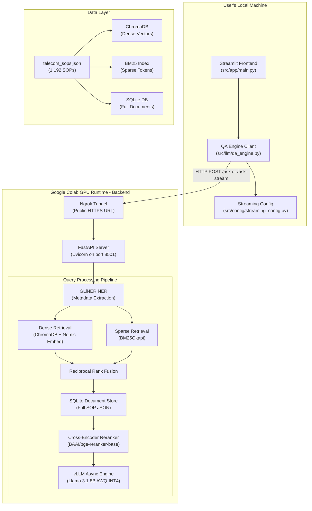
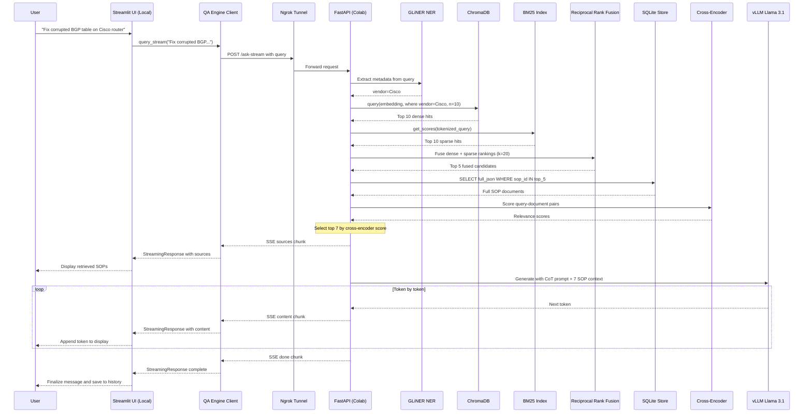

# NetRestore: Telecom Procedural QA RAG — Complete Architecture & Flow

> **Project Name:** NetRestore  
> **Domain:** Telecom Network Operations Center (NOC) Automation  
> **Purpose:** A Retrieval-Augmented Generation (RAG) system that retrieves precise Standard Operating Procedures (SOPs) for telecom network outages, faults, and incidents, then synthesizes step-by-step restoration guidance using an LLM.

---

## Table of Contents

1. [High-Level Architecture](#1-high-level-architecture)
2. [Directory Structure](#2-directory-structure)
3. [Data Layer — telecom_sops.json](#3-data-layer--telecom_sopsjson)
4. [Backend Pipeline (Google Colab Notebook)](#4-backend-pipeline-google-colab-notebook)
   - 4.1 [Data Ingestion and Dual-Store Indexing](#41-data-ingestion-and-dual-store-indexing)
   - 4.2 [Embedding Model — nomic-embed-text-v1.5](#42-embedding-model--nomic-embed-text-v15)
   - 4.3 [Vector Store — ChromaDB](#43-vector-store--chromadb)
   - 4.4 [Sparse Index — BM25Okapi](#44-sparse-index--bm25okapi)
   - 4.5 [Document Store — SQLite](#45-document-store--sqlite)
   - 4.6 [Metadata Extraction — GLiNER Zero-Shot NER](#46-metadata-extraction--gliner-zero-shot-ner)
   - 4.7 [Hybrid Retrieval — Reciprocal Rank Fusion](#47-hybrid-retrieval--reciprocal-rank-fusion)
   - 4.8 [Cross-Encoder Reranking — bge-reranker-base](#48-cross-encoder-reranking--bge-reranker-base)
   - 4.9 [LLM Generation — vLLM with Llama 3.1 8B AWQ-INT4](#49-llm-generation--vllm-with-llama-31-8b-awq-int4)
   - 4.10 [Prompt Engineering — Chain-of-Thought with Safety Guardrails](#410-prompt-engineering--chain-of-thought-with-safety-guardrails)
   - 4.11 [API Layer — FastAPI and Ngrok](#411-api-layer--fastapi-and-ngrok)
   - 4.12 [Streaming Endpoint — Server-Sent Events](#412-streaming-endpoint--server-sent-events)
5. [Frontend Application (src/)](#5-frontend-application-src)
   - 5.1 [Streamlit UI — src/app/main.py](#51-streamlit-ui--srcappmainpy)
   - 5.2 [QA Engine Client — src/llm/qa_engine.py](#52-qa-engine-client--srcllmqa_enginepy)
   - 5.3 [Streaming Configuration — src/config/streaming_config.py](#53-streaming-configuration--srcconfigstreaming_configpy)
6. [Evaluation and Benchmarking](#6-evaluation-and-benchmarking)
   - 6.1 [RAGAS Single-Turn Evaluation](#61-ragas-single-turn-evaluation)
   - 6.2 [Multi-Turn LLM-as-Judge Evaluation](#62-multi-turn-llm-as-judge-evaluation)
   - 6.3 [Performance Benchmarking](#63-performance-benchmarking)
7. [End-to-End Query Flow](#7-end-to-end-query-flow)
8. [Technology Stack Summary](#8-technology-stack-summary)

---

## 1. High-Level Architecture



The system follows a **client-server architecture** split across two runtimes:

| Component | Runtime | Why |
|---|---|---|
| **Frontend (Streamlit)** | Local machine | Low-latency interactive UI; no GPU needed |
| **Backend (RAG Pipeline)** | Google Colab (GPU) | vLLM needs a CUDA GPU for inference; free T4/A100 via Colab |
| **Tunnel (Ngrok)** | Colab to Internet | Bridges the Colab internal port to a public HTTPS endpoint the local frontend can reach |

> [!IMPORTANT]
> The backend runs **entirely inside a single Colab notebook** (`NLP_Telecom_QA_RAG.ipynb`). All indexing, retrieval, reranking, generation, and API serving happen in-process. The frontend is a lightweight HTTP client.

---

## 2. Directory Structure

```
Telecom_ProceduralQA_RAG/
├── NLP_Telecom_QA_RAG.ipynb   # Complete backend pipeline (Colab notebook)
├── telecom_sops.json          # Dataset: 1,192 structured telecom SOPs (~6.3 MB)
├── requirements.txt           # Frontend dependencies (streamlit, requests)
├── README.md
├── .gitignore
│
└── src/                       # Frontend application source
    ├── app/
    │   └── main.py            # Streamlit UI — chat interface and streaming display
    ├── config/
    │   ├── __init__.py
    │   └── streaming_config.py # Centralized configuration for streaming behavior
    ├── core/                   # (Reserved for future modules)
    └── llm/
        └── qa_engine.py       # HTTP client to the backend API — handles streaming and fallback
```

---

## 3. Data Layer — telecom_sops.json

### What It Is

A JSON file containing **1,192 structured Standard Operating Procedures** (SOPs) for telecom network restoration. Each SOP represents a single fault scenario and its step-by-step remediation.

### Why It Exists

Telecom NOC engineers must follow precise, vendor-specific procedures during outages. These SOPs encode domain expertise in a structured format that can be embedded, searched, and fed to an LLM as grounded context — preventing hallucination.

### Schema

```json
{
  "sop_id": "SOP-EE0B6FAC",
  "title": "SOP for SSL Decryption Bypass Disruption",
  "vendor": "Juniper",
  "severity": "WARNING",
  "estimated_time": "30",
  "prerequisites": [
    "Access to Juniper devices in SD-WAN fabric with operational privileges.",
    "Understanding of SD-WAN security policies..."
  ],
  "safety_warnings": [
    "Explicitly state blast radius: Malware enters network undetected...",
    "Warning: Do NOT confuse with SSL Certificate Expiry"
  ],
  "steps": [
    {
      "step_number": 1,
      "phase": "Diagnosis",
      "action": "Verify protocol adjacency flapping errors in system logs...",
      "command": "show log messages | match 'SSL decryption failed' | count",
      "expected_output": "A high and rapidly increasing count (>10/minute)..."
    }
  ],
  "search_content": "..."
}
```

| Field | Purpose |
|---|---|
| `sop_id` | Unique identifier for citation traceability in generated answers |
| `title` | Human-readable SOP name |
| `vendor` | Equipment manufacturer (Cisco, Juniper, Nokia, etc.) — used as a ChromaDB metadata filter |
| `severity` | CRITICAL / MAJOR / MINOR / WARNING — used as a ChromaDB metadata filter |
| `safety_warnings` | Critical "do NOT confuse with" guardrails injected into the LLM context |
| `steps` | Ordered CLI commands with expected outputs — the core procedural knowledge |
| `search_content` | Pre-computed prose representation rewritten at indexing time for better embedding quality |

---

## 4. Backend Pipeline (Google Colab Notebook)

The notebook (`NLP_Telecom_QA_RAG.ipynb`) is organized as a sequentially-executed pipeline. Each cell builds on the previous one.

---

### 4.1 Data Ingestion and Dual-Store Indexing

**Notebook Cell:** Cell 4

**What It Does:**
Reads all 1,192 SOPs from `telecom_sops.json` and indexes each SOP into **three** parallel stores:

1. **ChromaDB** — dense vector store for semantic retrieval
2. **BM25Okapi** — sparse token index for keyword retrieval
3. **SQLite** — document store for full SOP JSON retrieval

**Why Three Stores:**
This is a deliberately **decoupled architecture**:

- **ChromaDB** stores only the embedding vectors and lightweight metadata (vendor, severity). It handles *semantic similarity* — understanding that "BGP route flapping" and "routing table oscillation" mean the same thing.
- **BM25** captures *exact keyword matches* — critical in telecom where specific CLI commands, protocol acronyms (`iBGP`, `DWDM`, `AMF`), and error codes must be matched literally.
- **SQLite** stores the **full SOP JSON** (steps, commands, warnings). This avoids bloating the vector store with large documents and allows the system to fetch complete procedural data only for the final shortlisted candidates.

**Key Design Decision — Conversational Data Representation:**

```python
prose_content = f"This is a {severity} severity Standard Operating Procedure (SOP) for {vendor} equipment. "
prose_content += f"It resolves disruptions caused by {term}. The procedure involves the following steps: "
prose_content += steps_text
```

Rather than embedding the raw JSON, each SOP is rewritten into a **natural-language prose** format. This dramatically improves embedding quality because:
- Embedding models (trained on natural text) produce better vectors for prose than for JSON/structured data
- The prose version captures the intent semantically, not just the syntax

This rewritten text overwrites the `search_content` field and is what gets embedded and used for BM25 tokenization.

---

### 4.2 Embedding Model — nomic-embed-text-v1.5

**Notebook Cell:** Cell 1 (loaded via SentenceTransformers)

**What It Is:**
A state-of-the-art open-source text embedding model that converts text into 768-dimensional dense vectors.

**Why This Model:**
- Specifically trained for retrieval tasks with an instruction prefix format (`"Represent this sentence for searching relevant passages: "`)
- Strong performance on the MTEB benchmark for semantic textual similarity
- Lightweight enough to run on the Colab GPU alongside the main LLM
- Supports normalized embeddings for cosine similarity search

**How It's Used:**
- **At indexing time:** Encodes all 1,192 rewritten SOP prose documents into vectors and stores them in ChromaDB
- **At query time:** Encodes the user's query with the retrieval instruction prefix, then performs nearest-neighbor search against the stored vectors

---

### 4.3 Vector Store — ChromaDB

**Notebook Cell:** Cell 3

**What It Is:**
An in-process vector database that stores document embeddings and supports filtered nearest-neighbor search.

**Why ChromaDB:**
- Zero infrastructure overhead — runs in-memory inside the Colab process
- Native metadata filtering — allows the system to narrow searches by `vendor` and `severity` *before* computing vector distances
- Simple Python API — no external services to manage

**Configuration:**
- Database path: `/tmp/telecom_vector_db_{uuid}` (fresh on each Colab restart to avoid stale indexes)
- Collection: single collection holding all 1,192 SOP embeddings
- Metadata stored per document: `{"vendor": "Cisco", "severity": "CRITICAL"}`

---

### 4.4 Sparse Index — BM25Okapi

**Notebook Cell:** Cell 4

**What It Is:**
A classical probabilistic information retrieval algorithm that ranks documents by term frequency-inverse document frequency (TF-IDF) scoring.

**Why BM25 Alongside Dense Retrieval:**
Dense embeddings are powerful for semantic understanding but can miss exact keyword matches. In telecom, precision on specific terms matters critically:

| Query | Dense Retrieval Might Match | BM25 Will Match |
|---|---|---|
| "show ip bgp summary" | Generic BGP SOPs | SOPs containing the *exact* CLI command |
| "SOP-BGP808" | Unrelated SOPs about routing | The exact SOP by ID |
| "DWDM optics" | General optical SOPs | SOPs using the DWDM acronym specifically |

BM25 acts as a **precision safety net** — it catches literal matches that embedding-based search might miss.

**Tokenization:**
A custom `simple_tokenize()` function performs lowercase normalization and punctuation removal, matching the tokenization used at indexing time for consistency.

---

### 4.5 Document Store — SQLite

**Notebook Cell:** Cell 3 (schema creation) + Cell 4 (data insertion)

**What It Is:**
A lightweight relational database storing the full JSON representation of each SOP.

**Why SQLite:**
The vector store (ChromaDB) only holds the embedding and metadata — not the full document with all steps, commands, and safety warnings. When the retrieval pipeline selects the top candidates, it needs the complete SOP to build the context for the LLM. SQLite serves as this **full-document lookup store**.

**Schema:**
```sql
CREATE TABLE sops (
    sop_id   TEXT PRIMARY KEY,
    vendor   TEXT,
    severity TEXT,
    full_json TEXT   -- Complete SOP JSON, deserialized at query time
);
```

**Why Not Just Store Everything in ChromaDB:**
ChromaDB's document field has practical limits for large structured documents, and the query API is not optimized for fetching bulk document content. SQLite is purpose-built for fast primary-key lookups.

---

### 4.6 Metadata Extraction — GLiNER Zero-Shot NER

**Notebook Cell:** Cell 7

**What It Is:**
GLiNER (`urchade/gliner_small-v2.1`) is a lightweight Named Entity Recognition model that extracts structured metadata from the user's natural-language query without requiring a separate LLM call.

**Why GLiNER:**
When a user asks *"How do I fix a corrupted BGP table on a Cisco router?"*, the system needs to filter the vector search to only Cisco SOPs. Rather than using regex (brittle) or an LLM call (slow, expensive), GLiNER extracts:

- **Vendor:** "Cisco"
- **Severity:** (none detected in this query)

**How It Works:**

1. Define zero-shot labels: `["telecom vendor", "severity level"]`
2. Run prediction on the raw query string
3. Normalize extracted entities via a hardcoded `VENDOR_MAP` to match ChromaDB metadata casing exactly:
   ```python
   VENDOR_MAP = {
       "cisco": "Cisco",
       "juniper": "Juniper",
       "nokia": "Nokia",
       ...
   }
   ```
4. Build a ChromaDB `where` filter (e.g., `{"vendor": "Cisco"}` or `{"$and": [{"vendor": "Cisco"}, {"severity": "CRITICAL"}]}`)

**Resource Management:**
GLiNER runs on the **CPU** (`device_gliner = 'cpu'`) to preserve GPU VRAM for the main vLLM inference engine. This is a deliberate optimization — the small NER model is fast enough on CPU and does not compete for GPU memory.

> [!NOTE]
> If GLiNER extracts no entities, `chroma_filters` is set to `None`, and ChromaDB performs an unfiltered search over all SOPs.

---

### 4.7 Hybrid Retrieval — Reciprocal Rank Fusion

**Notebook Cell:** Cell 8

**What It Does:**
Combines the results from dense retrieval (ChromaDB) and sparse retrieval (BM25) into a single ranked list using Reciprocal Rank Fusion.

**The Algorithm:**

```
RRF_score(doc) = Sum of  1 / (k + rank_i(doc))  for each retriever i
```

Where `k = 20` (a tuning parameter that controls how aggressively top hits are favored) and `rank_i` is the document's rank in retriever `i`.

**Step-by-step:**

1. **Dense retrieval:** Query ChromaDB with the embedded query + GLiNER metadata filters → top 10 results
2. **Sparse retrieval:** Score all documents with BM25 → top 10 results
3. **Fusion:** For each document appearing in either list, compute its RRF score by summing its reciprocal ranks
4. **Sort and cut:** Take the top 5 fused candidates

**Why RRF:**
- It is a principled, parameter-light way to merge heterogeneous rankings
- It does not require score normalization (dense cosine similarities and BM25 scores are on completely different scales)
- `k = 20` aggressively favors the highest-ranked documents in each list, reducing noise before the expensive cross-encoder stage

**Why Not Just Use One Retriever:**
Neither retriever alone is sufficient:
- Dense-only misses exact keyword matches (CLI commands, SOP IDs)
- BM25-only misses semantic paraphrases ("routing table instability" is not equal to "BGP flapping" by keywords)
- The hybrid approach covers both failure modes

---

### 4.8 Cross-Encoder Reranking — bge-reranker-base

**Notebook Cell:** Cell 5 (model loading) + Cell 8 (inference)

**What It Is:**
A cross-encoder model that takes a `(query, document)` pair and produces a relevance score. Unlike bi-encoders (which encode query and document independently), cross-encoders process them jointly for much higher accuracy.

**Why Reranking:**
The initial retrieval (ChromaDB + BM25 + RRF) is optimized for **recall** — casting a wide net to find relevant candidates. The cross-encoder is optimized for **precision** — it reads both the query and each candidate document together and produces a fine-grained relevance judgment.

**How It Is Used:**

```python
pairs = [[query, doc["search_content"]] for doc in candidate_docs]
scores = reranker.predict(pairs)
ranked_final = sorted(zip(candidate_docs, scores), key=lambda x: x[1], reverse=True)
final_sops = [doc for doc, score in ranked_final][:7]
```

1. The 5 RRF candidates are paired with the query
2. The cross-encoder scores each pair
3. The candidates are re-sorted by cross-encoder score
4. The top **7** are kept as the final context for the LLM

**Why Top 7 (Not Top 3):**
The expanded context window (7 instead of 3) gives the LLM more SOPs to reason over, increasing the chance that the correct SOP is included. The LLM's chain-of-thought prompt instructs it to select the single most relevant one.

---

### 4.9 LLM Generation — vLLM with Llama 3.1 8B AWQ-INT4

**Notebook Cell:** Cell 5

**What It Is:**
The core language model that reads the retrieved SOPs and generates a step-by-step restoration guide. It runs via **vLLM**, a high-performance async inference engine.

**Model:** `hugging-quants/Meta-Llama-3.1-8B-Instruct-AWQ-INT4`

| Parameter | Value | Why |
|---|---|---|
| Quantization | AWQ-INT4 (`awq_marlin`) | Reduces model to ~4GB VRAM, fits on Colab's free T4 GPU (16GB) alongside the embedding model and reranker |
| `max_model_len` | 8192 | Large enough for system prompt + 7 SOPs + multi-turn history |
| `gpu_memory_utilization` | 0.7 | Reserves 30% of VRAM for ChromaDB, embeddings, and reranker |
| `enable_prefix_caching` | True | Caches KV-cache for the system prompt, speeding up repeated queries |
| `enforce_eager` | False | Enables CUDA graph optimization for faster generation |
| `temperature` | 0.0 | Deterministic outputs — critical for procedural accuracy |
| `max_tokens` | 2048 | Enough for detailed step-by-step answers |

**Why vLLM:**
Standard HuggingFace `transformers` inference is slow for interactive applications. vLLM provides:
- **Continuous batching** — can handle concurrent requests
- **PagedAttention** — efficient KV-cache memory management
- **Async generation** — yields tokens as they are produced, enabling streaming
- **CUDA graph optimization** — reduces kernel launch overhead

**Why Llama 3.1 8B:**
- Large enough for complex multi-step reasoning
- Small enough (especially at INT4) to fit on a free Colab GPU
- Instruction-tuned for following structured prompts

---

### 4.10 Prompt Engineering — Chain-of-Thought with Safety Guardrails

**Notebook Cell:** Cell 8

**The System Prompt:**

```
You are a factual Tier-1 NOC AI Assistant. You receive multiple SOPs.
You must follow these instructions exactly:
1. Identify the SINGLE most relevant SOP for the user's issue.
2. First, think step-by-step about why this SOP is correct. Prefix this section with 'REASONING:'.
3. Second, provide your final procedural answer. Prefix this section with 'FINAL_ANSWER:'.
4. In your final answer, do NOT generate artificial warnings unless the chosen SOP explicitly states them.
5. In your final answer, append the exact SOP ID in brackets for EVERY CLI command.
```

**Why This Design:**

| Instruction | Reason |
|---|---|
| "Identify the SINGLE most relevant SOP" | Prevents the LLM from merging steps from multiple SOPs, which could produce dangerous hybrid procedures |
| "REASONING:" prefix | Forces Chain-of-Thought — the model must explain its selection before answering, improving accuracy |
| "FINAL_ANSWER:" prefix | Creates a parsing boundary — the backend extracts only the content after this marker, stripping away the reasoning |
| "Do NOT generate artificial warnings" | Prevents hallucinated safety warnings. Only warnings explicitly stated in the SOP's `safety_warnings` field should appear |
| "Append the exact SOP ID in brackets" | Ensures every CLI command is traceable to its source SOP — critical for audit trails in NOC operations |

**Prompt Assembly:**
The `assemble_prompt()` function constructs a Llama 3.1 chat template with proper `<|start_header_id|>` / `<|eot_id|>` tokens, including multi-turn history for conversational context.

**Response Post-Processing:**
```python
if "FINAL_ANSWER:" in generated_text:
    answer = generated_text.split("FINAL_ANSWER:")[-1].strip()
else:
    answer = generated_text.strip()  # Emergency fallback
```

---

### 4.11 API Layer — FastAPI and Ngrok

**Notebook Cell:** Cell 15

**What It Does:**
Exposes the backend pipeline as a REST API that the local Streamlit frontend can call over the internet.

**Architecture:**

```
Streamlit (local) --> HTTPS --> Ngrok --> localhost:8501 --> FastAPI --> RAG Pipeline
```

**Endpoints:**

| Endpoint | Method | Purpose |
|---|---|---|
| `/ask` | POST | Synchronous query — returns complete answer + sources |
| `/ask-stream` | POST | Streaming query — returns Server-Sent Events |

**Request Schema:**
```json
{
  "query": "How do I fix corrupted BGP table on Cisco?",
  "history": [
    {"query": "previous question", "response": "previous answer"}
  ]
}
```

**Response Schema (/ask):**
```json
{
  "answer": "1. Access the Cisco router...",
  "retrieved_sops": [
    {"sop_id": "SOP-BGP808", "vendor": "Cisco", "severity": "CRITICAL", "title": "..."}
  ]
}
```

**Why Ngrok:**
Google Colab does not expose ports to the public internet. Ngrok creates a secure temporary tunnel, assigning a public HTTPS URL (e.g., `https://mia-propertied-cristopher.ngrok-free.dev`) that forwards traffic to `localhost:8501` inside the Colab VM.

**Why `nest_asyncio`:**
Colab already runs an asyncio event loop (for Jupyter). `nest_asyncio.apply()` patches asyncio to allow nesting, so Uvicorn can run its own event loop inside Colab's.

---

### 4.12 Streaming Endpoint — Server-Sent Events

**Notebook Cell:** Cell 9 (stream generator) + Cell 16 (FastAPI endpoint)

**What It Does:**
Provides real-time token-by-token streaming of the LLM's response using the **Server-Sent Events (SSE)** protocol.

**Why Streaming:**
vLLM generation for 2048 tokens can take several seconds. Without streaming, the user stares at a spinner. With streaming, tokens appear as they are generated, providing instant feedback.

**SSE Protocol:**
```
data: {"type": "sources", "sources": [...]}

data: {"type": "content", "content": "Step 1: Access..."}

data: {"type": "content", "content": " the Cisco router via SSH."}

data: {"type": "done"}
```

Each chunk is a JSON object prefixed with `data: ` and followed by two newlines (SSE standard). The frontend parses these incrementally.

**The `process_query_stream()` Generator:**
An async generator that:
1. Runs the same retrieval pipeline as `process_query()` (GLiNER, ChromaDB, BM25, RRF, SQLite, Cross-Encoder)
2. Yields the sources immediately (so the UI can show them before the answer)
3. Then yields content chunks as vLLM generates tokens:
   ```python
   async for output in engine.generate(prompt, sampling_params, req_id):
       text = output.outputs[0].text
       new_text = text[last_yielded_len:]
       if new_text:
           yield json.dumps({"type": "content", "content": new_text})
   ```
4. Yields a `{"type": "done"}` terminator

---

## 5. Frontend Application (src/)

The frontend is a **Streamlit chat application** that runs on the user's local machine. It communicates with the Colab backend exclusively via HTTP.

---

### 5.1 Streamlit UI — src/app/main.py

**What It Is:**
The user-facing chat interface for NetRestore. It provides a conversational experience where users type telecom fault descriptions and receive step-by-step restoration guidance.

**Key Components:**

#### Page Configuration
```python
st.set_page_config(
    page_title="NetRestore: Procedural QA RAG",
    page_icon="📡",
    layout="wide",
    initial_sidebar_state="collapsed"
)
```

#### Session State Management
Streamlit reruns the entire script on every interaction. Session state persists data across reruns:

| State Variable | Purpose |
|---|---|
| `messages` | Full chat history (role, content, sources) |
| `streaming_enabled` | Toggle for streaming vs. synchronous mode |
| `show_sources` | Toggle for displaying retrieved SOP sources |
| `current_sources` | Sources from the current streaming response |
| `streaming_complete` | Flag to track streaming completion |
| `current_query` | The query being actively streamed |

#### Custom CSS
Hides default Streamlit chrome (header, footer, menu) and adds:
- **Streaming cursor animation** — a blinking blue cursor during token streaming
- **Source container styling** — bordered cards for SOP source display
- **Error message styling** — highlighted warning boxes

#### Chat Display Loop
```python
for message in st.session_state.messages:
    display_message(message)
```
Renders the full conversation history. Assistant messages include expandable source sections showing the top 3 cross-encoder-ranked SOPs with SOP ID, vendor, severity, and title.

#### Streaming Response Handler
The `display_streaming_response()` function:
1. Checks if a streaming response is in progress (`streaming_complete == False`)
2. Iterates over `qa_engine.query_stream()` chunks
3. Renders sources immediately when received
4. Appends content to the message placeholder with a blinking cursor
5. On completion, finalizes the message and saves it to history

#### Non-Streaming Fallback
When streaming is disabled, uses `qa_engine.query()` for a single blocking request and displays the full response at once with a spinner.

#### Sidebar Controls
- **Streaming toggle** — switches between real-time streaming and blocking mode
- **Show Sources toggle** — shows/hides the retrieved SOP sources section
- **Clear Chat History** — resets the conversation
- **Message count** — displays the number of messages in the current session

---

### 5.2 QA Engine Client — src/llm/qa_engine.py

**What It Is:**
The HTTP client that communicates with the Colab backend. It abstracts all API communication and provides both streaming and non-streaming interfaces.

**Why This Module Exists:**
Separating the API client from the UI follows the **separation of concerns** principle. The Streamlit code only handles display logic; the QA engine handles network requests, error handling, response parsing, and fallback strategies.

#### Core Classes

**MockNode and MockResponse:**
```python
class MockResponse:
    def __init__(self, response_text: str, sops: list):
        self.response = response_text
        self.source_nodes = [MockNode(sop) for sop in sops]
```
These classes mimic LlamaIndex's response objects. This is a deliberate design decision — it allows the frontend to use the same parsing logic regardless of whether the response comes from a local LlamaIndex pipeline or a remote API.

**StreamingResponse:**
A data class representing a single chunk from the streaming API:
```python
class StreamingResponse:
    content: str       # Text content (empty for source/done chunks)
    sources: list      # Retrieved SOP metadata (empty for content/done chunks)
    complete: bool     # True when streaming is finished
    error: str | None  # Error message if something went wrong
```

#### Methods

**`query(query_str)` — Non-Streaming:**
1. Posts `{"query": query_str}` to `/ask`
2. Parses the JSON response into a `MockResponse`
3. Returns the complete answer + sources
4. Has comprehensive error handling for timeout, connection errors, and malformed responses

**`query_stream(query_str)` — Streaming:**
1. Posts to `/ask-stream` with SSE headers
2. Iterates over `response.iter_lines()` (HTTP streaming)
3. Parses each SSE `data:` line via `_parse_stream_chunk()`
4. Yields `StreamingResponse` objects
5. On failure, **automatically falls back** to `query_stream_mock()`

**`query_stream_mock(query_str)` — Mock Streaming:**
A fallback that simulates streaming by:
1. Making a regular `/ask` request
2. Splitting the full response into word-level chunks
3. Yielding them with a configurable delay (`0.05s` default)

This provides a seamless streaming experience even when the real streaming endpoint is unavailable (e.g., Ngrok tunnel dropped, endpoint not deployed yet).

**Automatic Fallback Chain:**
```
Real SSE Streaming (/ask-stream)
    --> Timeout? --> Mock Streaming (via /ask)
    --> Connection Error? --> Mock Streaming (via /ask)
    --> Streaming Disabled? --> Mock Streaming (via /ask)
```

---

### 5.3 Streaming Configuration — src/config/streaming_config.py

**What It Is:**
A centralized configuration class for all streaming-related parameters.

**Why It Exists:**
Rather than scattering magic numbers throughout the codebase, all configurable values live in one place. The configuration supports two layers:

1. **Hardcoded defaults** — sensible values for development
2. **Environment variable overrides** — for deployment customization without code changes

**Configuration Parameters:**

| Parameter | Default | Environment Variable | Purpose |
|---|---|---|---|
| `enabled` | `True` | `STREAMING_ENABLED` | Master toggle for streaming |
| `chunk_size` | `5` | `STREAMING_CHUNK_SIZE` | Words per chunk in mock streaming |
| `delay` | `0.05` | `STREAMING_DELAY` | Delay between mock chunks (seconds) |
| `timeout` | `5` | `STREAMING_TIMEOUT` | Connection timeout (seconds) |
| `api_url` | Ngrok URL | `API_URL` | Regular endpoint |
| `stream_url` | Ngrok URL | `STREAM_API_URL` | Streaming endpoint |
| `show_sources` | `True` | `SHOW_SOURCES` | Default source visibility |
| `max_message_history` | `100` | `MAX_MESSAGE_HISTORY` | Chat history limit |

---

## 6. Evaluation and Benchmarking

### 6.1 RAGAS Single-Turn Evaluation

**Notebook Cell:** Cell 11

**What It Is:**
An automated evaluation framework using the **RAGAS** library to measure RAG quality on a curated test set.

**Metrics:**

| Metric | What It Measures |
|---|---|
| **Faithfulness** | Does the answer only use information from the retrieved context? (Anti-hallucination) |
| **Answer Relevancy** | Does the answer address the question? |
| **Context Precision** | Are the retrieved documents relevant to the question? |
| **Context Recall** | Does the retrieved context contain all the information needed? |

**Judge Model:** `gemma-3-27b-it` via Google's Generative AI API — a much larger model than the generation LLM, used specifically as an unbiased evaluator.

**Test Set:** Curated telecom fault scenarios with ground-truth answers, including tricky "do NOT confuse with" cases that test whether the system avoids common telecom misattributions.

---

### 6.2 Multi-Turn LLM-as-Judge Evaluation

**Notebook Cell:** Cell 13

**What It Is:**
A custom evaluation framework for **multi-turn conversational accuracy** — the most challenging aspect of RAG systems.

**Why Standard RAGAS Is Not Enough:**
RAGAS evaluates single-turn Q&A. But NOC operators have multi-turn conversations:
1. "Fix the Cisco DWDM fiber link" --> (answer)
2. "Wait, check the Juniper BGP issue instead" --> (answer)
3. "Actually, go back to the fiber link. What was the warning?" --> **This is the hard part**

The system must remember Turn 1's context, ignore Turn 2's distraction, and correctly answer Turn 3.

**Evaluation Protocol:**

1. **14 multi-turn test scenarios** with deliberate "distraction turns" designed to confuse the system
2. Each scenario has a `reference` describing the expected behavior
3. An **LLM judge** (`gemma-3-27b-it`) scores each response on:
   - **Accuracy** (0-2): Correct root cause identification
   - **Topic** (0-2): Relevance to telecom domain
   - **Hallucination** (0-1): Did it invent false commands/facts?
   - **Reasoning** (0-2): Quality of multi-step logic
   - **Final Score** (0-10): Overall quality

**Key Design — Chain-of-Thought Evaluation:**
The judge prompt places `step_by_step_analysis` *before* the numerical scores in the JSON schema. This forces the judge LLM to reason before scoring, dramatically improving evaluation accuracy.

**Concurrency Control:**
Uses `asyncio.Semaphore(max_concurrent=3)` to prevent overwhelming both vLLM and the Gemini API with parallel requests.

---

### 6.3 Performance Benchmarking

**Notebook Cell:** Cell 12

**What It Is:**
A profiling suite that measures per-query latency and GPU memory consumption across the pipeline stages.

**Metrics Captured:**
- Retrieval phase latency (GLiNER + ChromaDB + BM25 + RRF + Reranking)
- Generation phase latency (vLLM)
- Total end-to-end latency
- Peak GPU VRAM usage

**Why This Exists:**
NOC operations are time-critical — every second of delay during an outage costs money. The benchmark validates that the pipeline meets real-time response requirements.

---

## 7. End-to-End Query Flow

Here is the complete journey of a user query through the system:



### Step-by-Step Summary

| Step | Component | Action |
|---:|---|---|
| 1 | **User** | Types a telecom fault query in the chat input |
| 2 | **Streamlit** | Saves the query to session state, triggers a rerun |
| 3 | **QA Engine** | Opens an HTTP streaming connection to `/ask-stream` via Ngrok |
| 4 | **GLiNER** | Extracts vendor ("Cisco") and/or severity from the query text on CPU |
| 5 | **ChromaDB** | Performs filtered dense vector search (top 10 results, vendor=Cisco) |
| 6 | **BM25** | Performs sparse keyword search (top 10 results) |
| 7 | **RRF** | Merges both ranked lists with k=20, selects top 5 candidates |
| 8 | **SQLite** | Retrieves full SOP JSON for the 5 candidates |
| 9 | **Cross-Encoder** | Re-scores each (query, SOP) pair, re-ranks, selects top 7 |
| 10 | **SSE** | Streams the source metadata to the frontend immediately |
| 11 | **vLLM** | Generates a Chain-of-Thought answer using the Llama 3.1 template, streaming tokens asynchronously |
| 12 | **Post-Processing** | Extracts content after FINAL_ANSWER marker |
| 13 | **Streamlit** | Displays each token with a blinking cursor, then finalizes the message |

---

## 8. Technology Stack Summary

| Layer | Technology | Role |
|---|---|---|
| **Frontend** | Streamlit | Chat UI |
| **API Client** | Python `requests` | HTTP + SSE streaming |
| **API Server** | FastAPI + Uvicorn | REST + streaming endpoints |
| **Tunnel** | Ngrok (pyngrok) | Exposes Colab to internet |
| **Embedding** | `nomic-ai/nomic-embed-text-v1.5` | Dense text embeddings |
| **Vector Store** | ChromaDB | Filtered nearest-neighbor search |
| **Sparse Search** | BM25Okapi (`rank_bm25`) | Keyword matching |
| **Document Store** | SQLite | Full SOP JSON storage |
| **NER** | GLiNER (`gliner_small-v2.1`) | Zero-shot metadata extraction |
| **Reranker** | `BAAI/bge-reranker-base` | Cross-encoder relevance scoring |
| **LLM** | Llama 3.1 8B AWQ-INT4 | Answer generation |
| **LLM Runtime** | vLLM (AsyncLLMEngine) | High-performance GPU inference |
| **Evaluation** | RAGAS + Custom LLM-as-Judge | Automated quality measurement |
| **Judge LLM** | Gemma-3-27b-it (Google GenAI) | Evaluation scoring |

---

> [!TIP]
> To run the complete system:
> 1. Open `NLP_Telecom_QA_RAG.ipynb` in Google Colab (GPU runtime)
> 2. Run all cells sequentially — the last cell starts the API server and prints the Ngrok URL
> 3. Update the API URLs in `src/llm/qa_engine.py` and `src/config/streaming_config.py` with the new Ngrok URL
> 4. Run the frontend locally: `streamlit run src/app/main.py`
